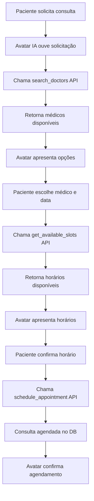

# Sistema de Agendamento de Consultas via Avatar IA

## 📋 Visão Geral

O avatar IA (MediAI) agora pode **consultar médicos cadastrados** e **agendar consultas com médicos reais** da plataforma.

## 🎯 Funcionalidades Implementadas

### 1. APIs para o Agente IA

#### **GET /api/ai-agent/doctors**
Busca médicos disponíveis na plataforma.

**Parâmetros:**
- `specialty` (opcional): Especialidade médica (ex: "cardiologia")
- `limit` (opcional): Número máximo de resultados (padrão: 10)

**Resposta:**
```json
{
  "success": true,
  "doctors": [
    {
      "id": "doctor-uuid",
      "name": "Dr. João Silva",
      "specialty": "Cardiologia",
      "crm": "12345-SP",
      "online": true,
      "bio": "Especialista em...",
      "consultationPrice": 200
    }
  ],
  "count": 5
}
```

#### **GET /api/ai-agent/schedule**
Verifica horários disponíveis de um médico.

**Parâmetros:**
- `doctorId`: ID do médico
- `date`: Data no formato YYYY-MM-DD

**Resposta:**
```json
{
  "success": true,
  "date": "2024-11-20",
  "doctorId": "doctor-uuid",
  "availableSlots": [
    {"startTime": "09:00", "endTime": "09:30"},
    {"startTime": "10:00", "endTime": "10:30"}
  ],
  "totalAvailable": 12
}
```

#### **POST /api/ai-agent/schedule**
Agenda uma consulta.

**Body:**
```json
{
  "doctorId": "doctor-uuid",
  "patientId": "patient-uuid",
  "patientName": "Maria Santos",
  "date": "2024-11-20",
  "startTime": "10:00",
  "endTime": "10:30",
  "type": "consultation",
  "notes": "Consulta para avaliação cardíaca"
}
```

**Resposta:**
```json
{
  "success": true,
  "appointmentId": "appointment-uuid",
  "message": "Consulta agendada com sucesso para 2024-11-20 às 10:00"
}
```

### 2. Funções Python no Agente

O agente possui 3 funções helper:

- **`search_doctors(specialty, limit)`** - Busca médicos
- **`get_available_slots(doctor_id, date)`** - Verifica horários
- **`schedule_appointment(...)`** - Agenda consulta

### 3. Prompt do Sistema

O avatar foi instruído sobre suas capacidades:

```
✅ VOCÊ PODE AGENDAR CONSULTAS - Você tem acesso aos médicos cadastrados 
   na plataforma e pode agendar consultas reais
✅ Você pode buscar médicos por especialidade e verificar disponibilidade 
   de horários

AGENDAMENTO DE CONSULTAS:
- Quando o paciente solicitar consulta com médico especialista, você pode:
  1. Buscar médicos disponíveis por especialidade
  2. Verificar horários disponíveis
  3. Agendar a consulta diretamente
- Sempre confirme os detalhes antes de agendar (data, horário, especialidade)
- Informe claramente ao paciente quando um agendamento for confirmado
```

## 🧪 Como Testar

### Pré-requisitos

1. Ter médicos cadastrados no sistema
2. Configurar `AGENT_SECRET` nas variáveis de ambiente
3. Reiniciar o workflow do agente

### Cenário de Teste

**Conversa com o Avatar:**

1. **Usuário:** "Gostaria de agendar uma consulta com um cardiologista"
   
2. **Avatar (deve):** 
   - Buscar cardiologistas disponíveis
   - Apresentar opções
   - Perguntar preferência de data

3. **Usuário:** "Pode ser amanhã de manhã"

4. **Avatar (deve):**
   - Verificar horários disponíveis
   - Apresentar slots disponíveis
   - Confirmar agendamento

5. **Resultado:** Consulta agendada no banco de dados

## 🔧 Configuração

### Variáveis de Ambiente Necessárias

```bash
# Backend API
NEXT_PUBLIC_URL=https://seu-dominio.vercel.app
AGENT_SECRET=sua-chave-secreta-aqui

# Database (já configurado)
DATABASE_URL=postgresql://...
```

### Segurança

Todas as APIs verificam o header `x-agent-secret` para autenticação:

```python
if agentSecret !== process.env.AGENT_SECRET:
    return 401 Unauthorized
```

## 📊 Fluxo Completo



## ⚠️ Limitações Atuais

1. **Gemini Live API** ainda não suporta function calling nativo
2. Implementação manual das chamadas (pode requerer parsing de intenções)
3. Necessita integração adicional com sistema de notificações

## 🚀 Próximos Passos

1. ✅ APIs criadas
2. ✅ Funções Python implementadas
3. ✅ Prompt atualizado
4. ⏳ Testar com médicos reais
5. ⏳ Adicionar notificações de agendamento
6. ⏳ Integrar com sistema de lembretes

## 📝 Notas Técnicas

- **Horário comercial:** 8h às 18h (configurável em `scheduling.ts`)
- **Duração padrão:** Slots de 30 minutos
- **Verificação de conflitos:** Automática antes de agendar
- **Status inicial:** Consultas criadas com status `scheduled`
