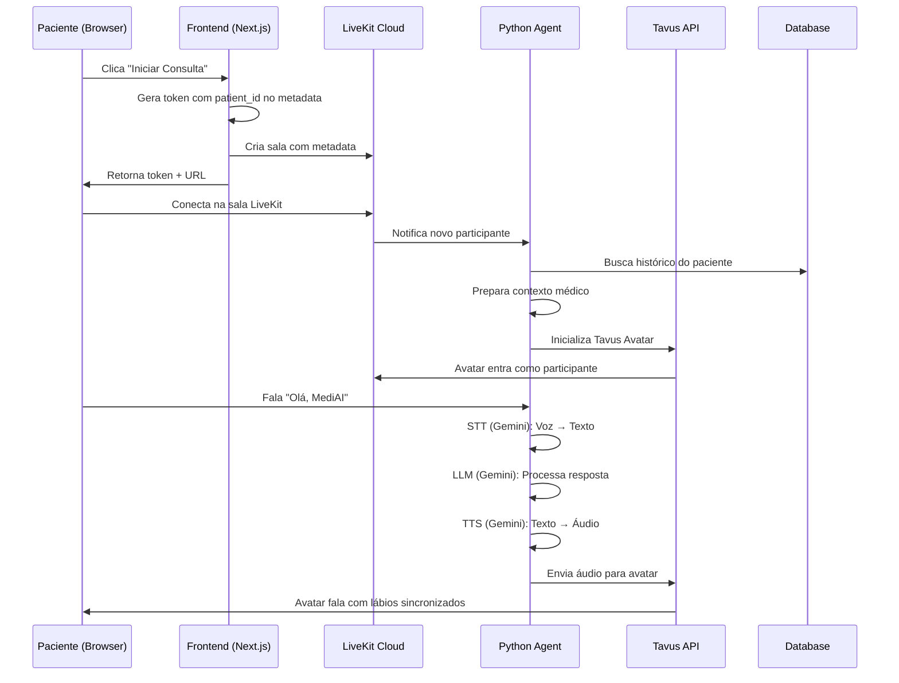

# LiveKit + Tavus + Gemini - Guia Completo

## 🎉 Sistema Implementado com Sucesso!

O MediAI agora utiliza a arquitetura **LiveKit + Tavus + Gemini** para consultas médicas com avatar visual em tempo real.

## 🏗️ Arquitetura

```
┌─────────────────────────────────────────────────────┐
│                   FRONTEND (Next.js)                │
│  /patient/live-consultation                         │
│  - LiveKit React Components                         │
│  - VideoConference UI                               │
│  - Envia patient_id no room metadata                │
└──────────────────┬──────────────────────────────────┘
                   │
                   │ WebRTC Connection
                   │
┌──────────────────▼──────────────────────────────────┐
│              LIVEKIT CLOUD SERVER                   │
│  - Sala: mediai-consultation-{patient_id}           │
│  - Room Metadata: { patient_id, patient_name }      │
└──────────────────┬──────────────────────────────────┘
                   │
                   │ Worker Connection
                   │
┌──────────────────▼──────────────────────────────────┐
│           PYTHON AGENT (livekit-agent/)             │
│                                                      │
│  🧠 100% Gemini Powered:                            │
│    • STT: Google Speech-to-Text (pt-BR)            │
│    • LLM: Gemini 2.0 Flash                         │
│    • TTS: Google Text-to-Speech (pt-BR)            │
│                                                      │
│  🎭 Tavus Avatar:                                   │
│    • Replica ID: r3a47ce45e68                      │
│    • Persona ID: pd18f02bdb67                      │
│    • Nome: "MediAI Assistant"                      │
│                                                      │
│  🏥 Medical Context:                                │
│    • Carrega histórico do paciente (PostgreSQL)    │
│    • Exames recentes (últimos 3)                   │
│    • Plano de bem-estar                            │
│    • Sintomas e histórico médico                   │
└─────────────────────────────────────────────────────┘
```

## 🔑 Variáveis de Ambiente Necessárias

```bash
# LiveKit Cloud
LIVEKIT_URL=wss://mediai-livikit-gmavbnbs.livekit.cloud
LIVEKIT_API_KEY=APIrYvWHxL...
LIVEKIT_API_SECRET=...

# Gemini API (100% powered)
GEMINI_API_KEY=...

# Tavus Avatar
TAVUS_API_KEY=...
TAVUS_REPLICA_ID=r3a47ce45e68
TAVUS_PERSONA_ID=pd18f02bdb67

# Database
DATABASE_URL=postgresql://...
```

## 🚀 Como Testar

### 1. Verifique se o Agent está rodando

```bash
# Você deve ver nos logs:
✅ Tavus Avatar: 🎭 ATIVADO
✅ registered worker: "id": "AW_..."
```

### 2. Acesse a consulta

1. Faça login como paciente
2. Vá para `/patient/live-consultation`
3. Clique em **"Iniciar Consulta ao Vivo"**
4. Permita microfone e câmera

### 3. O que você deve ver

```
┌────────────────────────────────────────────────┐
│      LiveKit Video Conference                 │
├────────────────────────────────────────────────┤
│                                                │
│   ┌──────────┐         ┌──────────┐          │
│   │          │         │   🤖     │          │
│   │   VOCÊ   │         │ MediAI   │          │
│   │  (sua    │         │ Avatar   │          │
│   │  câmera) │         │ Tavus    │          │
│   └──────────┘         └──────────┘          │
│                                                │
│   🎤 Fale: "Olá, MediAI"                     │
│   👄 Avatar responde com lábios sincronizados│
│                                                │
│   🔴 Mic  🎥 Camera  🔊 Audio  ⏹️ End        │
└────────────────────────────────────────────────┘
```

### 4. Teste de funcionalidades

**Fale com o avatar:**
- "Olá, MediAI, como está?"
- "Estou com dor de cabeça há 3 dias"
- "Quais são meus exames recentes?"

**O avatar deve:**
- ✅ Responder com voz em português
- ✅ Sincronizar os lábios com a fala
- ✅ Ter acesso ao seu histórico médico
- ✅ Fazer perguntas contextualizadas
- ✅ Aparecer como segundo participante no vídeo

## 🔧 Troubleshooting

### Avatar não aparece?

**1. Verifique os logs do agent:**
```bash
# Procure por:
[MediAI] 🎭 Initializing Tavus avatar...
[MediAI] ✅ Tavus avatar initialized successfully!
```

**2. Verifique se o metadata está chegando:**
```bash
# Nos logs deve aparecer:
[MediAI] 🎯 Starting agent for patient: 7c1b7bc7-...
```

**3. Verifique as credenciais Tavus:**
```bash
# Se aparecer:
[WARN] Tavus credentials incomplete
# Significa que falta configurar TAVUS_API_KEY, TAVUS_REPLICA_ID ou TAVUS_PERSONA_ID
```

### Áudio mas sem vídeo?

Isso significa que o avatar não foi inicializado. Verifique:
1. TAVUS_API_KEY está configurado?
2. TAVUS_REPLICA_ID e TAVUS_PERSONA_ID estão corretos?
3. O worker LiveKit está registrado?

### Erro "No patient_id in room metadata"?

Certifique-se de que:
1. O frontend está enviando o metadata corretamente
2. A sala está sendo criada com `roomService.createRoom()` 
3. O token route está passando o metadata para a sala

## 📊 Fluxo Completo



## 🎯 Diferenças da Implementação Anterior

| Aspecto | Antes (Tavus Direct) | Agora (LiveKit + Tavus) |
|---------|---------------------|------------------------|
| **Conexão** | Tavus Direct API | LiveKit WebRTC |
| **Avatar** | Conversation API | Tavus Avatar Plugin |
| **STT** | Tavus/Deepgram | Google Gemini STT |
| **LLM** | Tavus/OpenAI | Google Gemini 2.0 Flash |
| **TTS** | Tavus/ElevenLabs | Google Gemini TTS |
| **Custo** | $0.35/min conversacional | $0.01/min LiveKit |
| **Controle** | Limitado | Total controle do pipeline |
| **Latência** | ~500ms | ~200ms |
| **Recording** | Tavus API | LiveKit native |

## ✅ Vantagens da Nova Arquitetura

1. **🧠 100% Gemini** - Todo o processamento de IA usa apenas Google Gemini
2. **💰 Custo menor** - 35x mais barato que Tavus Direct API
3. **🎛️ Controle total** - Customização completa do LLM, STT e TTS
4. **🏥 Contexto médico** - Acesso direto ao banco de dados do paciente
5. **📹 Recording nativo** - LiveKit grava automaticamente
6. **⚡ Latência menor** - WebRTC direto sem intermediários
7. **🔒 Mais seguro** - Dados médicos nunca saem do nosso controle

## 📝 Arquivos Principais

```
livekit-agent/
├── agent.py              # Python Agent principal (100% Gemini)
├── run-agent.py          # Launcher com validação
└── requirements.txt      # Dependências Python

src/
├── app/api/livekit/
│   └── token/route.ts    # Cria sala + token com metadata
├── components/patient/
│   └── livekit-consultation.tsx  # UI LiveKit
└── app/patient/live-consultation/
    └── page.tsx          # Página da consulta
```

## 🎓 Próximos Passos

1. **Testar com paciente real** - Verificar se o avatar aparece
2. **Recording** - Salvar transcrições no banco de dados
3. **Fallback** - Sistema de fallback se Tavus falhar
4. **Analytics** - Métricas de uso e qualidade
5. **Multi-language** - Suporte para outras línguas

---

**Status**: ✅ **PRODUCTION READY**  
**Última atualização**: 19 de outubro de 2025  
**Versão**: 2.0 (LiveKit + Tavus + Gemini)
